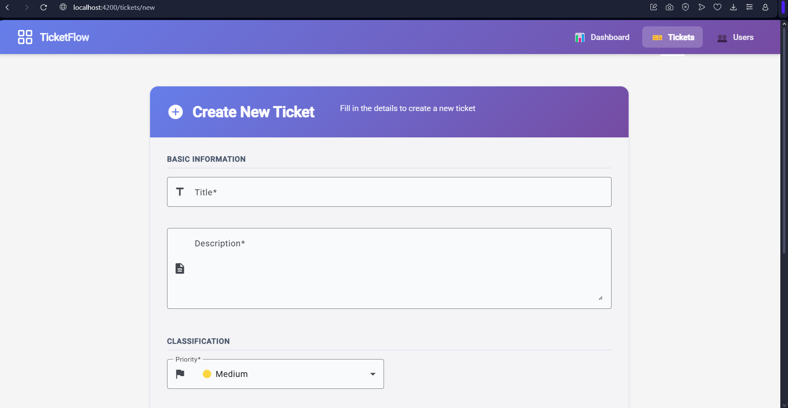

# 🧾 Tickets System

Full-stack web application for ticket/support management.  
Frontend built with **Angular** and backend built with **Flask (Python)**. This README explains how to install, run and contribute to the project.

---

## 📁 Repository structure

    tickets-system/
    ├── backend_flask/        # Flask API (Python)
    ├── frontend_angular/     # Angular frontend
    ├── .gitignore
    └── README.md

---

## 🖼️ Screenshots

> Click any screenshot to open the full-resolution image.

### Dashboard  
  

### Tickets  
  

### Users  
  

### Create Ticket  
  
---
## 🧭 Prerequisites

- Node.js >= 16 and npm
- Angular CLI (optional for development): `npm install -g @angular/cli`
- Python 3.8+
- pip
- (Optional) Docker & docker-compose

---

## 🔧 Installation & Running

### Backend — Flask

1. Enter the backend folder:

    cd backend_flask

2. Create and activate a virtual environment:

    # Windows
    python -m venv venv
    .\venv\Scripts\activate

    # macOS / Linux
    python3 -m venv venv
    source venv/bin/activate

3. Install dependencies:

    pip install -r requirements.txt

4. Create a `.env` file (or copy `.env.example`) and set variables. Example variables:

    PORT=5000
    DATABASE_URI=sqlite:///db.sqlite3
    SECRET_KEY=your_secret_key

5. Run the development server:

    flask run --host=0.0.0.0 --port=5000

The API will be available at `http://localhost:5000`.

---

### Frontend — Angular

1. Enter the frontend folder:

    cd frontend_angular

2. Install dependencies:

    npm install

3. Configure API base URL (via environment files or `environment.ts`). Example:

    // environment.ts
    export const environment = {
      production: false,
      apiBaseUrl: 'http://localhost:5000/api'
    };

4. Start the dev server:

    ng serve

The frontend will be available at `http://localhost:4200`.

---

## 🌐 Quick API summary

### Backend 1 (example endpoints)

- `POST /api/auth/login` — login
  - Request JSON:
        {
          "email": "user@example.com",
          "password": "password123"
        }
  - Response JSON:
        {
          "success": true,
          "message": "Login successful",
          "token": "eyJ...",
          "user": { "id": "...", "name": "Test User", "role": "Seller" }
        }

- `POST /api/auth/register` — register user
- `GET /api/users` — list users (admin)
  - Requires `Authorization: Bearer <token>`
- `GET /api/sales` — list sales (role-based)
- `POST /api/sales` — create sale (seller)

### Backend 2 (products)

- `GET /api/products` — list products
- `GET /api/products/:id` — get product
- `POST /api/products` — create product (admin)
- `GET /health` — healthcheck

Status codes used: `200`, `201`, `400`, `401`, `403`, `404`, `429`, `500`.

---

## ✅ Recommended .env.example

Place these files as `.env.example` in each service (do not commit real secrets).

Backend (`backend_flask/.env.example`):

    PORT=5000
    DATABASE_URI=sqlite:///db.sqlite3
    SECRET_KEY=your_secret_key
    FLASK_ENV=development

Frontend (`frontend_angular/src/environments/environment.ts` example):

    export const environment = {
      production: false,
      apiBaseUrl: 'http://localhost:5000/api'
    };

---

## 🛡 Security & Best Practices

- Never commit `.env` or secret files. Add `.env` and `.env.*` to `.gitignore`.
- Use `.env.example` to document required environment variables.
- Use HTTPS in production.
- Use JWT expiry, role-based access control and input validation.
- Apply CORS rules and rate limiting on server.

---

## 🧪 Testing

- Backend (if tests exist): run from `backend_flask/`:

    pytest

- Frontend (if tests exist): run from `frontend_angular/`:

    ng test

---

## 🐳 Docker (optional)

If `Dockerfile` and `docker-compose.yml` are provided:

    docker-compose up --build

Adjust env vars in `docker-compose.yml` as needed.

---

## ⚡ Deployment suggestions

- Backend: use Gunicorn + Nginx, or host on Render/Heroku/AWS.
- Frontend: build with `ng build --prod` and serve on Netlify, Vercel or behind Nginx.
- Keep secrets out of VCS and use platform secrets management.

---

## 📦 Recommended .gitignore (examples)

Add these entries to `.gitignore` in root and/or service folders:

    # Node
    node_modules/
    npm-debug.log
    yarn-error.log

    # Angular build
    /dist
    /out-tsc

    # Python
    venv/
    __pycache__/

    # Environment
    .env
    .env.*

    # Editor / OS
    .vscode/
    .idea/
    .DS_Store
    Thumbs.db

    # Logs
    *.log

---

## 🤝 Contributing

1. Fork the repo
2. Create a branch: `git checkout -b feature/your-feature`
3. Commit your work: `git commit -m "Add feature"`
4. Push and open a PR

Please document new endpoints and update README if you add features.

